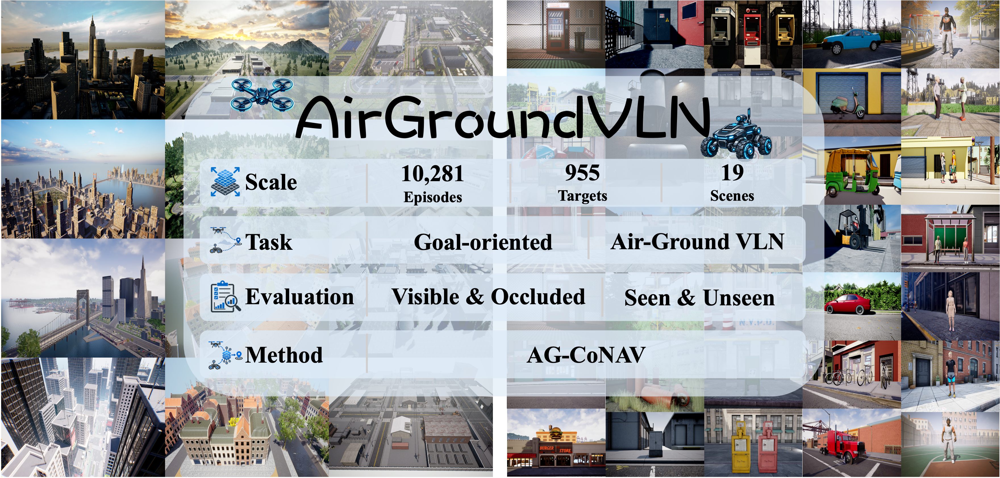

<div align="center">


<h1>AirGroundVLN: A Large-Scale Benchmark for Goal-Oriented Air-Ground Collaborative Vision-and-Language Navigation</h1>

<p>
  Zhenxuan Zeng,
  Qingle Wu,
  Wei Suo<sup>†</sup>,
  Maojia Wu,
  Bairong Zhang,
  Hangzheng Yu,
  Peng Wang
</p>

<p>
  School of Computer Science, Northwestern Polytechnical University, China<br/>
  <sup>†</sup>Corresponding author
</p>

<!-- Replace the placeholder links below when the public resources are available. -->
[](https://arxiv.org/abs/2610.10421)
[](https://peakpang.github.io/AirGroundVLN-Project/)
[](https://youtu.be/XvuNdebI-iA)
[](#)

</div>

## 💡 Introduction

<div align="center">
  
</div>

**AirGroundVLN** is a large-scale benchmark for goal-oriented air-ground collaborative Vision-and-Language Navigation (VLN). The benchmark contains **10,281** navigation episodes, **955** target instances, and **19** diverse scenes for goal-oriented air-ground collaborative VLN. It supports evaluation across **aerial-visible/aerial-occluded** target conditions and seen/unseen environments. **AG-CoNAV** is provided as a trainable reference framework for this setting.

## 📢 News

<!-- Add project updates here. -->

## 📜 Citing

If you find AirGroundVLN useful in your research or applications, please consider citing it with the following BibTeX entry:

```bibtex
@misc{zeng2026airgroundvln,
      title={AirGroundVLN: A Large-Scale Benchmark for Goal-Oriented Air-Ground Collaborative Vision-and-Language Navigation}, 
      author={Zhenxuan Zeng and Qingle Wu and Wei Suo and Maojia Wu and Bairong Zhang and Hangzheng Yu and Peng Wang},
      year={2026},
      eprint={2610.10421},
      archivePrefix={arXiv},
      primaryClass={cs.RO},
      url={https://arxiv.org/abs/2610.10421}, 
}
```
